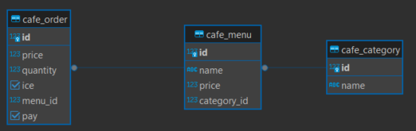

# Cafe Kiosk

Cafe Kiosk with Django.

---

## 페이지 설명

### 루트 페이지
- 주문하기
- 관리하기
- 관리자 페이지 (admin) 이동

### 주문하기
1. 카테고리 리스트 보기
2. 메뉴 리스트 보기
3. 메뉴 디테일 보기
4. 주문하기
5. 결제하기

#### 주문, 결제 과정
1. 메뉴 상세 페이지에서 수량 / 아이스 여부 선택 후 주문하기 버튼 클릭
2. 가격 및 주문 정보 확인
3. 결제하기 버튼 클릭 -> 결제 완료
4. '홈' : 루트페이지 이동 / '추가 주문' 카테고리 리스트 이동

### 관리하기
- 메뉴 추가, 수정, 삭제하기

#### 1. 메뉴 추가하기
- 카테고리, 메뉴 이름, 가격 입력

#### 2,3. 메뉴 수정하기, 삭제하기
- 아직 구현 전

### 관리자 페이지 이동
- admin 페이지 이동 후 menu, category, order 정보 관리

## 데이터 모델

- category
- menu
- order

